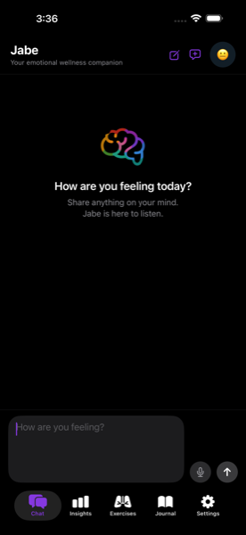
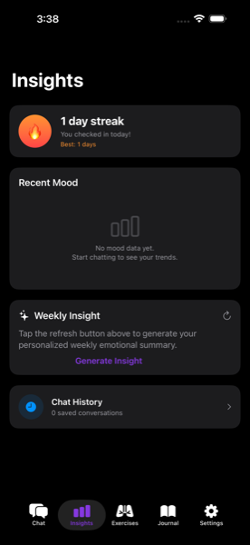
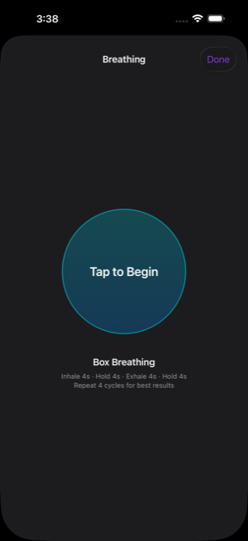
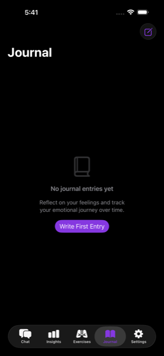

<p align="center">
  
</p>

<h1 align="center">Jabe Wellness AI</h1>
<p align="center"><em>Your Emotional Wellness Companion</em></p>

<p align="center">
  An iOS emotional wellness companion built with SwiftUI. Talk to Jabe the way you'd talk to a trusted friend —
  open-ended AI conversation, mood tracking, guided exercises, and private journaling, all on your device.
</p>

<p align="center">
  <a href="https://apps.apple.com/app/jabe-wellness/id6797912257">
    
  </a>
</p>

<p align="center"><sub>Free to download · iPhone · iOS 17.6+</sub></p>

<p align="center">
  
  
  
  
</p>

---

## Features

**Free** — AI chat with full open-ended conversation · mood detection with color-coded bubbles · crisis-language safety checker (988 Lifeline + Crisis Text Line) · chat history · journal · theming

**Premium** — 7-day mood trends chart · streak tracking · AI weekly insights · guided exercises (box breathing, grounding, CBT reframing) · voice input · journal export

## Privacy by design

Conversations and journal entries are stored **only on your device** using `UserDefaults`. There is no cloud sync, no account, and no analytics. Journal text never leaves the device. Chat messages are sent to the AI provider solely to generate a reply.

Full policy: [privacy.html](docs/privacy.html)

> Jabe is a wellness companion, not a licensed therapist, and does not provide medical advice.

## Built with

SwiftUI (iOS 17.6+) · Swift concurrency · StoreKit 2 · `SFSpeechRecognizer` + `AVAudioEngine` · Swift Testing + XCTest

## Quick start

Requires macOS with Xcode 26+ and an iOS 17.6+ simulator or iPhone. No package dependencies.

```bash
git clone https://github.com/jabelarde1994-glitch/JabeWellnessAI.git
cd JabeWellnessAI
```

Create the gitignored secrets file — a fresh clone will **not** build without it:

```swift
// JabeWellnessAI/SecretsStore.swift
enum SecretsStore {
    static let groqAPIKey = "gsk_YOUR_KEY_HERE"
}
```

Get a free key at [console.groq.com/keys](https://console.groq.com/keys), then open `JabeWellnessAI.xcodeproj` and run with ⌘R.

To exercise in-app purchases, set the scheme's StoreKit configuration in Xcode — **Product → Scheme → Edit Scheme → Run → Options → StoreKit Configuration → `Storekit.storekit`**. Set it through the UI; the relative path in `.xcscheme` isn't safe to hand-edit.

Run tests with ⌘U, or:

```bash
xcodebuild test -project JabeWellnessAI.xcodeproj -scheme JabeWellnessAI \
  -destination 'platform=iOS Simulator,name=iPhone 17 Pro Max'
```

## License

Proprietary — all rights reserved. Published for portfolio review; not licensed for redistribution or commercial use. See [LICENSE](LICENSE).
