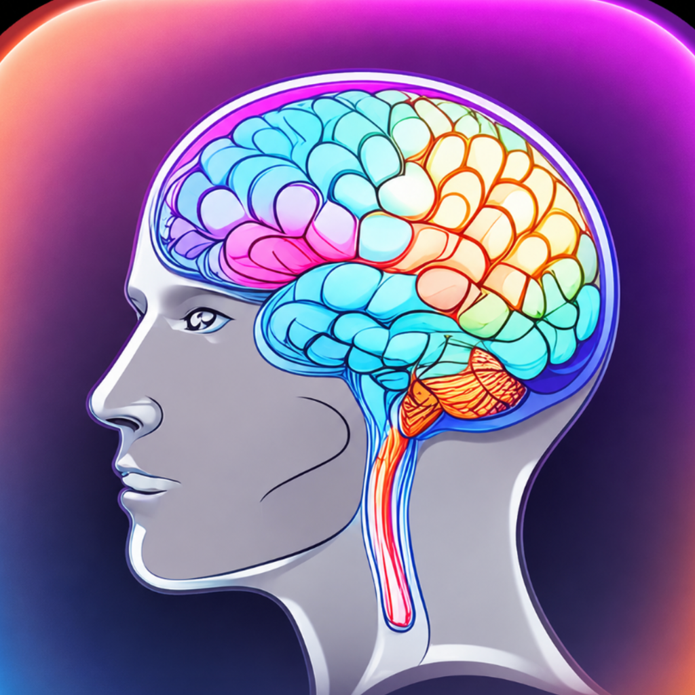

<p align="center">
  
</p>

<h1 align="center">Jabe Wellness AI</h1>
<p align="center"><em>Your Emotional Wellness Companion</em></p>

Jabe Wellness AI is an iOS emotional wellness companion built with SwiftUI. Users talk naturally with Jabe as they would a trusted friend. Powered by a large language model (LLM), Jabe provides empathetic conversations, mood tracking, guided wellness exercises, and journaling.

Unlike meditation timer apps or scripted wellness chatbots, Jabe delivers genuine open-ended AI conversations tailored to each interaction.

Formerly named **MindMirror** — renamed to **Jabe Wellness AI** on 2026-06-24.

---

## 1. Project Overview

| | |
|---|---|
| Platform | iOS 17.0+, built with Xcode 26.0.1 |
| Status | Core functionality complete. App Store submission pending Apple Developer account. |
| Bundle ID | `com.jabe.wellnessai` |
| StoreKit product | `com.jabe.premium` — $3.99 one-time, 7-day free trial |
| AI backend | Groq API, `llama-3.3-70b-versatile` |

---

## 2. Features

### Free
- AI chatbot with full open-ended conversation
- Mood detection with color-coded bubbles
- Safety checker (988 Lifeline + Crisis Text Line) for crisis language
- Onboarding with clinician disclaimer, splash screen
- Chat history, Journal
- Settings, theming

### Premium ($3.99 one-time, 7-day trial)
- Mood Trends Chart (7-day)
- Streak tracking
- AI Weekly Insights
- Guided Exercises (Box Breathing, Grounding, CBT Reframing)
- Voice Input
- Journal Export (ShareSheet)

---

## 3. Technology Stack

- **UI:** SwiftUI (iOS 17.0+)
- **Concurrency:** Swift `async`/`await`
- **AI:** Groq API (`llama-3.3-70b-versatile`), free tier — 30 RPM / 14,400 RPD
- **Persistence:** `UserDefaults` only — no cloud sync, no backend, no third-party data sharing
- **Speech:** `SFSpeechRecognizer` + `AVAudioEngine` for voice input
- **In-App Purchase:** StoreKit 2, tested via a committed `Storekit.storekit` configuration
- **Testing:** Swift Testing (`JabeWellnessAITests`), XCTest (`JabeWellnessAIUITests`)

---

## 4. Getting Started

### Requirements

- macOS with Xcode 26.0.1+ installed
- An iOS 17.0+ simulator or physical iPhone
- A free [Groq](https://console.groq.com/keys) account for an API key
- No CocoaPods / Swift Package dependencies — the app has none

### Installation

1. Clone the repository:
   ```bash
   git clone https://github.com/jabelarde1994-glitch/JabeWellnessAI.git
   cd JabeWellnessAI
   ```
2. Open `JabeWellnessAI.xcodeproj` in Xcode 26+.
3. Create the (gitignored) secrets file — a fresh clone will **not** build without this:
   `JabeWellnessAI/SecretsStore.swift`
   ```swift
   enum SecretsStore {
       static let groqAPIKey = "gsk_YOUR_KEY_HERE"
   }
   ```
   Get a free key at [console.groq.com/keys](https://console.groq.com/keys).

### Build & Run

1. Select the **JabeWellnessAI** scheme and an iPhone simulator or device (iPhone-only — no iPad support).
2. Confirm the scheme's StoreKit Configuration is set: **Product → Scheme → Edit Scheme → Run → Options → StoreKit Configuration → `Storekit.storekit`**. This must be set through Xcode's UI, not by hand-editing the `.xcscheme` file — Xcode's relative-path resolution for that field isn't safe to author manually.
3. Build and run with **⌘R**, or from the command line:
   ```bash
   xcodebuild -project JabeWellnessAI.xcodeproj -scheme JabeWellnessAI -destination 'platform=iOS Simulator,name=iPhone 16' build
   ```

### Testing

Run tests with **⌘U**, or:

```bash
xcodebuild test -project JabeWellnessAI.xcodeproj -scheme JabeWellnessAI -destination 'platform=iOS Simulator,name=iPhone 16'
```

---

## 5. Project Structure

Repository layout:

```
JabeWellnessAI/
├── JabeWellnessAI.xcodeproj/
│   └── xcshareddata/xcschemes/JabeWellnessAI.xcscheme
├── JabeWellnessAI/                      # App target
│   ├── ContentView.swift                # Entire app: models, view model, services, views (~2700 lines)
│   ├── SecretsStore.swift               # Gitignored — Groq API key (create locally, see Installation)
│   ├── Storekit.storekit                # StoreKit Testing config (committed, no secrets)
│   ├── Info.plist
│   ├── JabeWellnessAI.entitlements
│   └── Assets.xcassets/                 # App icon, accent color
├── JabeWellnessAITests/                 # Unit tests
├── JabeWellnessAIUITests/               # UI tests
└── docs/                                # README (this file) + App Store privacy policy page
```

Architecture summary — single-file SwiftUI app (`ContentView.swift`, ~2700 lines) organized MVVM-style:

- **Models** — `ChatMessage`, `ChatSession`, `JournalEntry` (all `Codable`)
- **ViewModel** — `JournalViewModel` (chat send/receive, mood detection, session lifecycle)
- **Services** — `AIService` (Groq calls), `StorageManager` (UserDefaults), `StreakManager`, `PremiumManager` (StoreKit 2), `VoiceInputManager`, `SentimentAnalyzer` / `EmotionDetector` / `SafetyChecker`

The free tier covers the AI chat with mood detection and the safety checker; premium adds mood trend tracking, streaks, weekly AI insights, guided exercises, voice input, and journal export.

---

## 6. Documentation

README.md — this file: overview, setup, and build instructions.

The remaining documents are internal project records kept locally and are not published to this repository:

ARCHITECTURE.md — components, data flow, storage strategy, and implementation notes.

DECISIONS.md — product, architecture, platform, and infrastructure decisions with their reasoning.

CHANGELOG.md — reverse-chronological history of notable project changes.

ROADMAP.md — planned work, blockers, and completed milestones.

APPLE_REVIEW.md — App Store submission readiness, requirements, and pre-submission checklist.

MARKETING.md — marketing assets, messaging decisions, and launch strategy.

SECURITY.md — credential handling, data-transmission boundaries, and security review notes.

---

## 7. Current Status

Current milestone

Core functionality complete — AI chat and premium purchase/restore verified working end-to-end. App Store screenshots have been completed for all supported device sizes, managed outside this repository.

Upcoming milestone

App Store submission, pending an Apple Developer Program account.
